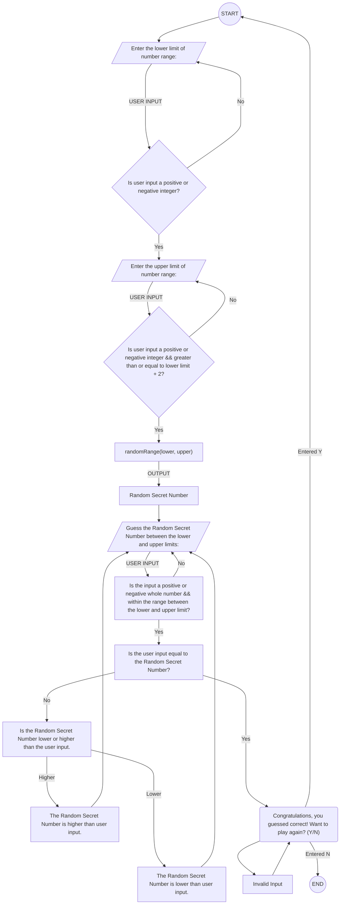

# Number Guessing Game

## Description of the Steps in the Guessing Game
### Program Start
* <ins>Step 1</ins>: The point of this guessing game is to guess the randomly generated number that falls within a specified range taking a lower and upper limit from user input.
* <ins>Step 2</ins>: First, the program starts.
### User Input: Lower Limit
* <ins>Step 3</ins>: Next, the user is asked to input a postive or negative integer for the lower limit of the number range.
* <ins>Step 4</ins>: Next, this input is validated to make sure that it is a postive or negative integer and is not any other type.
* <ins>Step 5</ins>: If the user input is invalid it loops back to Step 3.
* <ins>Step 6</ins>: If the user input is valid it stores the input and proceeds to the next step.
### User Input: Upper Limit
* <ins>Step 7</ins>: Next, the user is asked to input a positive or negative integer for the upper limit of the number range.
  In addition to this requirement the integer must also be greater than or equal to the lower limit + 2. This is needed to prevent the user from entering the same integer twice
  or using two consecutive numbers, either of which will not work since we are working with integers.
* <ins>Step 8</ins>: If the user input is invalid per the Step 7 requirements, it loop back.
* <ins>Step 9</ins>: If the user input is valid it stores the input and proceeds to the next step.
### randomRange() Function Call to Generate Random Secret Number
* <ins>Step 10</ins>: The two user inputs are used in a function called `randomRange()` which takes two arguments one for the lower range and one for the upper.
  This computes a Random Secret Number not shown to the user.
### Guessing the Random Secret Number
* <ins>Step 11</ins>: Next, the user is asked to guess the Random Secret Number between the lower and upper limit.
* <ins>Step 12</ins>: The user input is first validated to make sure that the input is a positive or negative integer that is also within the number range.
* <ins>Step 13</ins>: If the user input is invalid it loops back to Step 12.
* <ins>Step 14</ins>: If the user input is valid then the program checks if the input is equal to the Random Secret Number.
* <ins>Step 15</ins>: If the user input is not equal to the Random Secret Number it checks to see if the number guessed is either lower or higher than the Random Secret Number.
  In either case the program tells the user if it is lower or higher and then loops back to Step 11.
### Correct Guess and Program End
* <ins>Step 16</ins>: If the user input equals the Random Secret Number than the program tells the user "Congratulations, you guessed correct! Want to play again? (Y/N)".
* <ins>Step 17</ins>: Entering anything other than "Y" or "N" tells the user invalid input and loops the user back to Step 16.
* <ins>Step 18</ins>: Entering "Y" loops the user back to Step 2.
* <ins>Step 19</ins>: Entering "N" ends the program.
